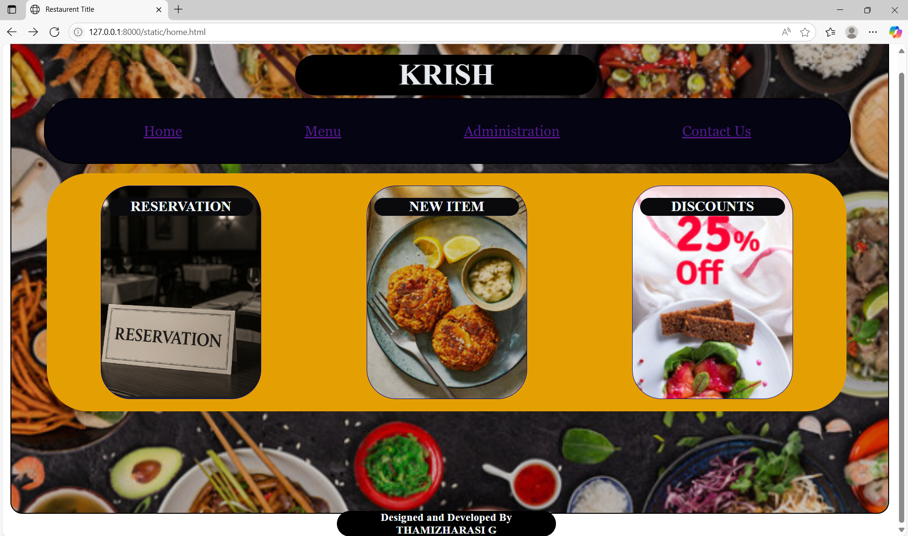
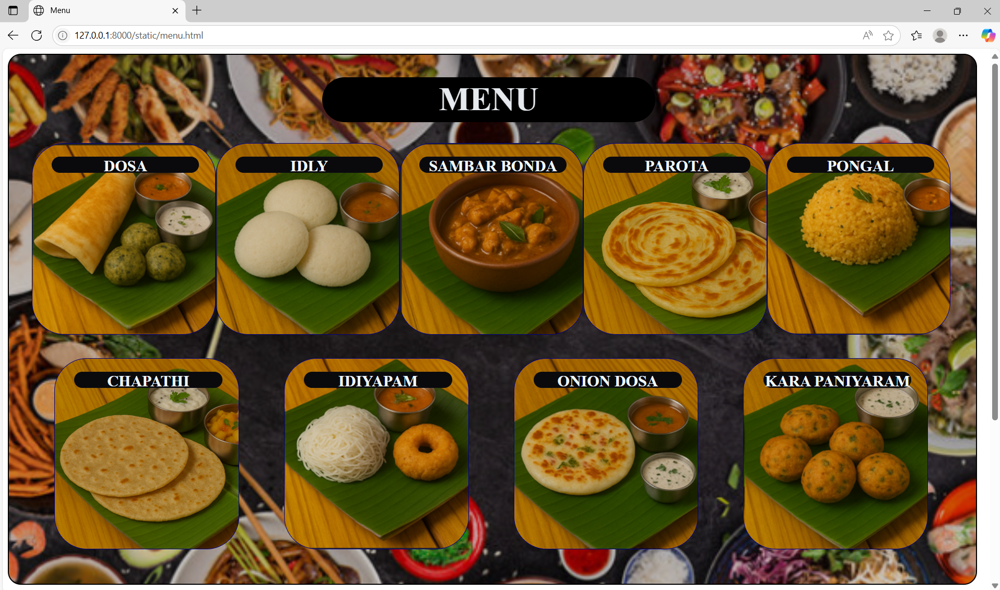
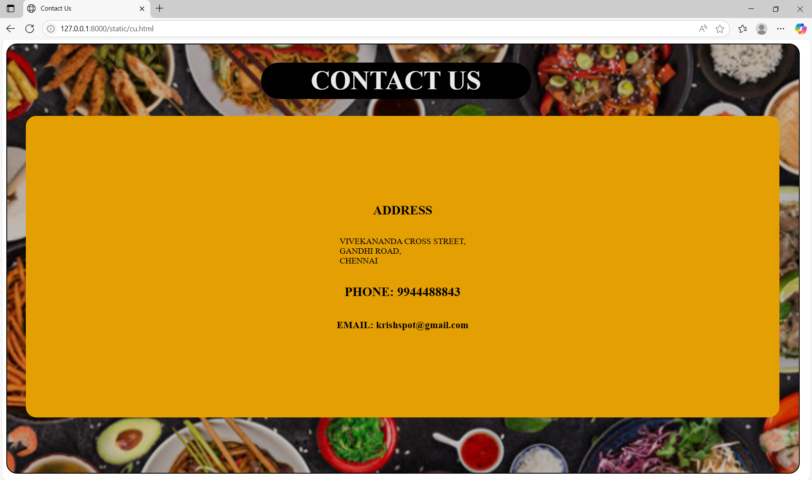

# Ex.07 Restaurant Website
# Date:14.05.2025
# AIM:
To develop a static Restaurant website to display the food items and services provided by them.

# DESIGN STEPS:
## Step 1:
Requirement collection.

## Step 2:
Creating the layout using HTML and CSS.

## Step 3:
Updating the sample content.

## Step 4:
Choose the appropriate style and color scheme.

## Step 5:
Validate the layout in various browsers.

## Step 6:
Validate the HTML code.

## Step 7:
Publish the website in the given URL.

# PROGRAM:
```
main.html

<html>
    <title>Restaurent Title</title>
    <head>
        <style>
            body{
                display: flex ;
                justify-content: center;
                align-items: center;
            }
            .main{
                width: 99%;
                height: 99%;
                background-color: bisque;
                justify-content: center;
                border: 2px solid black;
                border-radius: 20px;
                background-image: url("main.png");
                background-repeat: no-repeat;
                background-size: cover;
            }
            .main h1{
                width: 500px;
                position: relative;
                top: 1px;
                left: 480px;
                border: 1px;
                border-radius: 100px;
                padding: 5px;
                background-color: black;
                color:rgb(230, 234, 238);
                
                font-family: 'Times New Roman', Times, serif;
                font-size:  50px;
            }
            .home{
                background-color: rgb(4, 4, 19);
                color: aliceblue;
                border: 2px solid black;
                border-radius: 50px;
                width: 90%;
                position: absolute;
                top: 120px;
                left: 70px;
                display: flex;
                justify-content: space-evenly;
            }
            .h1{
                
                margin: 20px;
                padding: 20px;
                font-family: Georgia, 'Times New Roman', Times, serif;
                font-size: x-large;
            }
            .contents{
                display: flex;
                align-items: center;
                flex-direction:row;
                justify-content: space-around;
                width: 91%;
                height: 400px;
                position: relative;
                top: 100px;
                left: 60px;
                border: 2px solid rgb(228, 160, 2);
                background-color: rgb(228, 160, 2);
                border-radius: 70px;
            }
            .m1{
                display: flex;
                
                justify-content: center;
                
                width: 20%;
                height: 90%;
                color: rgb(217, 223, 230,217);
                background-image: url("re.png");
                background-size: cover;
                background-color: darkblue;
                border: 1px solid darkblue;
                border-radius: 50px;
            }
            h2{
                
                color: aliceblue;
                border: 1px solid rgb(12, 12, 20);
                background-color: rgb(10, 10, 13);
                width: 90%;
                height: 8%;
                border-radius: 80px;  
            }
            .m2{
                display: flex;
                justify-content: center;
                width: 20%;
                height: 90%;
                color: aliceblue;
                background-image: url("sp.png");
                background-size: cover;
                background-color: darkblue;
                border: 1px solid darkblue;
                border-radius: 50px;
            }
            .m3{
                display: flex;
                justify-content: center;
                width: 20%;
                height: 90%;
                color: aliceblue;
                background-image: url("of1.png");
                background-size: cover;
                background-color: rgb(30, 30, 187);
                border: 1px solid rgb(17, 17, 164);
                border-radius: 50px;
            }
            .foot{
                border: 2px;
                width: 25%;
                border-radius: 60px;
                background-color: black;
                color: aliceblue;
                position: relative;
                bottom: -250px;
                left: 550px;
            }
        </style>
    </head>
    <body>
        <div class="main">
            <h1 align="center">KRISH</h1>
            <div class="home">
                <div class="h1"><a href="home.html">Home</a></div>
                <div class="h1"><a href="menu.html">Menu</a></div>
                <div class="h1"><a href="admin.html">Administration</a></div>
                <div class="h1"><a href="cu.html">Contact Us</a></div>
            </div>
            <div class="contents">
                 <div class="m1">
                    <h2 align="center">RESERVATION</h2>
                    
                 </div>
                 <div class="m2">
                    <h2 align="center">NEW ITEM</h2>
                 </div>
                 <div class="m3">
                    <h2 align="center">DISCOUNTS</h2>
                 </div>
            </div>
            <div class="foot">
                <h3 align="center">Designed and Developed By THAMIZHARASI G</h3>
            </div>
        </div>
    </body>
</html>

home.html

<html>
    <title>Restaurent Title</title>
    <head>
        <style>
            body{
                display: flex ;
                justify-content: center;
                align-items: center;
            }
            .main{
                width: 99%;
                height: 99%;
                background-color: bisque;
                justify-content: center;
                border: 2px solid black;
                border-radius: 20px;
                background-image: url("main.png");
                background-repeat: no-repeat;
                background-size: cover;
            }
            .main h1{
                width: 500px;
                position: relative;
                top: 1px;
                left: 480px;
                border: 1px;
                border-radius: 100px;
                padding: 5px;
                background-color: black;
                color:rgb(230, 234, 238);
                
                font-family: 'Times New Roman', Times, serif;
                font-size:  50px;
            }
            .home{
                background-color: rgb(4, 4, 19);
                color: aliceblue;
                border: 2px solid black;
                border-radius: 50px;
                width: 90%;
                position: absolute;
                top: 120px;
                left: 70px;
                display: flex;
                justify-content: space-evenly;
            }
            .h1{
                
                margin: 20px;
                padding: 20px;
                font-family: Georgia, 'Times New Roman', Times, serif;
                font-size: x-large;
            }
            .contents{
                display: flex;
                align-items: center;
                flex-direction:row;
                justify-content: space-around;
                width: 91%;
                height: 400px;
                position: relative;
                top: 100px;
                left: 60px;
                border: 2px solid rgb(228, 160, 2);
                background-color: rgb(228, 160, 2);
                border-radius: 70px;
            }
            .m1{
                display: flex;
                
                justify-content: center;
                
                width: 20%;
                height: 90%;
                color: rgb(217, 223, 230,217);
                background-image: url("re.png");
                background-size: cover;
                background-color: darkblue;
                border: 1px solid darkblue;
                border-radius: 50px;
            }
            h2{
                
                color: aliceblue;
                border: 1px solid rgb(12, 12, 20);
                background-color: rgb(10, 10, 13);
                width: 90%;
                height: 8%;
                border-radius: 80px;  
            }
            .m2{
                display: flex;
                justify-content: center;
                width: 20%;
                height: 90%;
                color: aliceblue;
                background-image: url("sp.png");
                background-size: cover;
                background-color: darkblue;
                border: 1px solid darkblue;
                border-radius: 50px;
            }
            .m3{
                display: flex;
                justify-content: center;
                width: 20%;
                height: 90%;
                color: aliceblue;
                background-image: url("of1.png");
                background-size: cover;
                background-color: rgb(30, 30, 187);
                border: 1px solid rgb(17, 17, 164);
                border-radius: 50px;
            }
            .foot{
                border: 2px;
                width: 25%;
                border-radius: 60px;
                background-color: black;
                color: aliceblue;
                position: relative;
                bottom: -250px;
                left: 550px;
            }
        </style>
    </head>
    <body>
        <div class="main">
            <h1 align="center">KRISH</h1>
            <div class="home">
                <div class="h1"><a href="home.html">Home</a></div>
                <div class="h1"><a href="menu.html">Menu</a></div>
                <div class="h1"><a href="admin.html">Administration</a></div>
                <div class="h1"><a href="cu.html">Contact Us</a></div>
            </div>
            <div class="contents">
                 <div class="m1">
                    <h2 align="center">RESERVATION</h2>
                    
                 </div>
                 <div class="m2">
                    <h2 align="center">NEW ITEM</h2>
                 </div>
                 <div class="m3">
                    <h2 align="center">DISCOUNTS</h2>
                 </div>
            </div>
            <div class="foot">
                <h3 align="center">Designed and Developed By THAMIZHARASI G</h3>
            </div>
        </div>
    </body>
</html>

menu.html

<html>
    <title>Menu</title>
    <head>
        <style>
            .main{
                width: 99%;
                height: 99%;
                background-color: bisque;
                justify-content: center;
                border: 2px solid black;
                border-radius: 20px;
                background-image: url("main.png");
                background-repeat: no-repeat;
                background-size: cover;
            }
            .main h1{
                width: 500px;
                position: relative;
                top: 1px;
                left: 480px;
                border: 1px;
                border-radius: 100px;
                padding: 5px;
                background-color: black;
                color:rgb(230, 234, 238);
                
                font-family: 'Times New Roman', Times, serif;
                font-size:  50px;
            }

            .h1{
                display: flex;
                justify-content: space-around;
                position: relative;
                left: 35px;
                width: 95%;
                height: 90%;
            }
            .h2{
                display: flex;
                justify-content: space-around;
                position: relative;
                left: 35px;
                bottom: 400px;
                width: 95%;
                height: 90%;
            }
            .i1{
                width: 20%;
                height: 40%;
                color: rgb(217, 223, 230,217);
                background-image: url("dos.png");
                background-size: cover;
                background-color: darkblue;
                border: 1px solid darkblue;
                border-radius: 50px;
            }
            .i2{
                width: 20%;
                height: 40%;
                color: rgb(217, 223, 230,217);
                background-image: url("id.png");
                background-size: cover;
                background-color: darkblue;
                border: 1px solid darkblue;
                border-radius: 50px;
            }
            .i3{
                width: 20%;
                height: 40%;
                color: rgb(217, 223, 230,217);
                background-image: url("bo.png");
                background-size: cover;
                background-color: darkblue;
                border: 1px solid darkblue;
                border-radius: 50px;
            }
            .i4{
                width: 20%;
                height: 40%;
                color: rgb(217, 223, 230,217);
                background-image: url("paro.png");
                background-size: cover;
                background-color: darkblue;
                border: 1px solid darkblue;
                border-radius: 50px;
            }
            .i5{
                width: 20%;
                height: 40%;
                color: rgb(217, 223, 230,217);
                background-image: url("samba.png");
                background-size: cover;
                background-color: darkblue;
                border: 1px solid darkblue;
                border-radius: 50px;
            }
            .i6{
                width: 20%;
                height: 40%;
                color: rgb(217, 223, 230,217);
                background-image: url("chap.png");
                background-size: cover;
                background-color: darkblue;
                border: 1px solid darkblue;
                border-radius: 50px;
            }
            .i7{
                width: 20%;
                height: 40%;
                color: rgb(217, 223, 230,217);
                background-image: url("idiy.png");
                background-size: cover;
                background-color: darkblue;
                border: 1px solid darkblue;
                border-radius: 50px;
            }
            .i8{
                width: 20%;
                height: 40%;
                color: rgb(217, 223, 230,217);
                background-image: url("ondo.png");
                background-size: cover;
                background-color: darkblue;
                border: 1px solid darkblue;
                border-radius: 50px;
            }
            .i9{
                width: 20%;
                height: 40%;
                color: rgb(217, 223, 230,217);
                background-image: url("ku.png");
                background-size: cover;
                background-color: darkblue;
                border: 1px solid darkblue;
                border-radius: 50px;
            }
            h2{
                color: aliceblue;
                position: relative;
                left: 30px;
                border: 1px solid rgb(12, 12, 20);
                background-color: rgb(10, 10, 13);
                width: 80%;
                height: 8%;
                border-radius: 80px;
            }
        </style>
    </head>
    <body>
        <div class="main">
            <h1 align="center">MENU</h1>
            
                <div class="h1">
                    <div class="i1">
                        <h2 align="center">DOSA</h2>

                    </div>
                    <div class="i2">
                        <h2 align="center">IDLY</h2>

                    </div>
                    <div class="i3">
                        <h2 align="center">SAMBAR BONDA</h2>

                    </div>
                    <div class="i4">
                        <h2 align="center">PAROTA</h2>

                    </div>
                    <div class="i5">
                        <h2 align="center">PONGAL</h2>

                    </div>
                </div>
                <div class="h2">
                    <div class="i6">
                        <h2 align="center">CHAPATHI</h2>

                    </div>
                    <div class="i7">
                        <h2 align="center">IDIYAPAM</h2>

                    </div>
                    <div class="i8">
                        <h2 align="center">ONION DOSA</h2>

                    </div>
                    <div class="i9">
                        <h2 align="center">KARA PANIYARAM</h2>

                    </div>
                </div>
            
        </div>
    </body>
</html>


admin.html

<html>
    <title>Administration</title>
    <head>
        <style>
            .main{
                width: 99%;
                height: 99%;
                background-color: bisque;
                justify-content: center;
                border: 2px solid black;
                border-radius: 20px;
                background-image: url("main.png");
                background-repeat: no-repeat;
                background-size: cover;
            }
            .main h1{
                width: 500px;
                position: relative;
                top: 1px;
                left: 480px;
                border: 1px;
                border-radius: 100px;
                padding: 5px;
                background-color: black;
                color:rgb(230, 234, 238);
                
                font-family: 'Times New Roman', Times, serif;
                font-size:  50px;
            }

            .h1{
                display: flex;
                justify-content: space-around;
                position: relative;
                left: 35px;
                width: 95%;
                height: 90%;
            }
            .h2{
                display: flex;
                justify-content: space-around;
                position: relative;
                left: 35px;
                bottom: 400px;
                width: 95%;
                height: 90%;
            }
            .i1{
                width: 20%;
                height: 40%;
                color: rgb(217, 223, 230,217);
                background-image: url("m.png");
                background-size: cover;
                background-color: darkblue;
                border: 1px solid darkblue;
                border-radius: 50px;
            }
            .i2{
                width: 20%;
                height: 40%;
                color: rgb(217, 223, 230,217);
                background-image: url("ma.png");
                background-size: cover;
                background-color: darkblue;
                border: 1px solid darkblue;
                border-radius: 50px;
            }
            .i3{
                width: 20%;
                height: 40%;
                color: rgb(217, 223, 230,217);
                background-image: url("cch.png");
                background-size: cover;
                background-color: darkblue;
                border: 1px solid darkblue;
                border-radius: 50px;
            }
            .i4{
                width: 20%;
                height: 40%;
                color: rgb(217, 223, 230,217);
                background-image: url("c.png");
                background-size: cover;
                background-color: darkblue;
                border: 1px solid darkblue;
                border-radius: 50px;
            }
            .i5{
                width: 20%;
                height: 40%;
                color: rgb(217, 223, 230,217);
                background-image: url("w.png");
                background-size: cover;
                background-color: darkblue;
                border: 1px solid darkblue;
                border-radius: 50px;
            }
            .i6{
                width: 20%;
                height: 40%;
                color: rgb(217, 223, 230,217);
                background-image: url("se.png");
                background-size: cover;
                background-color: darkblue;
                border: 1px solid darkblue;
                border-radius: 50px;
            }
            h2{
                color: aliceblue;
                position: relative;
                left: 30px;
                border: 1px solid rgb(12, 12, 20);
                background-color: rgb(10, 10, 13);
                width: 80%;
                height: 8%;
                border-radius: 80px;  
            }
            h3{
                color: aliceblue;
                position: relative;
                left: 30px;
                bottom: -200px;
                border: 1px solid rgb(12, 12, 20);
                background-color: rgb(10, 10, 13);
                width: 80%;
                height: 8%;
                
            }
        </style>
    </head>
    <body>
        <div class="main">
            <h1 align="center">ADMINISTRATOR</h1>
            
                <div class="h1">
                    <div class="i1">
                        <h2 align="center">ALYA</h2>
                        <h3 align="center">MANAGER</h3>
                    </div>
                    <div class="i2">
                        <h2 align="center">SRI</h2>
                        <h3 align="center">ASST. MANAGER</h3>
                    </div>
                    <div class="i3">
                        <h2 align="center">KISHORE</h2>
                        <h3 align="center">CHEF</h3>
                    </div>
                </div>
                <div class="h2">
                    <div class="i4">
                        <h2 align="center">ANBU</h2>
                        <h3 align="center">CASHIER</h3>
                    </div>
                    <div class="i5">
                        <h2 align="center">EESWARAN</h2>
                        <h3 align="center">WAITER</h3>
                    </div>
                    <div class="i6">
                        <h2 align="center">DURAI</h2>
                        <h3 align="center">SERVANT</h3>
                    </div>
                </div>
            
        </div>
    </body>
</html>

cu.html

<html>
    <title>Contact Us</title>
    <head>
        <style>
            .main{
                width: 99%;
                height: 99%;
                background-color: bisque;
                justify-content: center;
                border: 2px solid black;
                border-radius: 20px;
                background-image: url("main.png");
                background-repeat: no-repeat;
                background-size: cover;
            }
            .main h1{
                width: 500px;
                position: relative;
                top: 1px;
                left: 480px;
                border: 1px;
                border-radius: 100px;
                padding: 5px;
                background-color: black;
                color:rgb(230, 234, 238);
                
                font-family: 'Times New Roman', Times, serif;
                font-size:  50px;
            }
            .det{
                display: flex;
                flex-direction: column;
                align-items: center;
                justify-content: center;
                position: relative;
                left: 35px;
                width: 95%;
                height: 70%;
                border: 2px solid rgb(228, 160, 2);
                border-radius: 20px;
                background-color: rgb(228, 160, 2);
            }
        </style>
    </head>
    <body>
        <div class="main">
            <h1 align="center">CONTACT US</h1>
            <div class="det">
                <h2 align="center">ADDRESS</h2>
                <p>VIVEKANANDA CROSS STREET,<BR>
                    GANDHI ROAD,<br>
                    CHENNAI
                </p>
                <h2 align="center"> PHONE: 9944488843</h2>
                <h3>EMAIL: krishspot@gmail.com</h3>
            </div>
        </div>
    </body>
</html>
```
# OUTPUT:




# RESULT:
The program for designing software company website using HTML and CSS is completed successfully.
